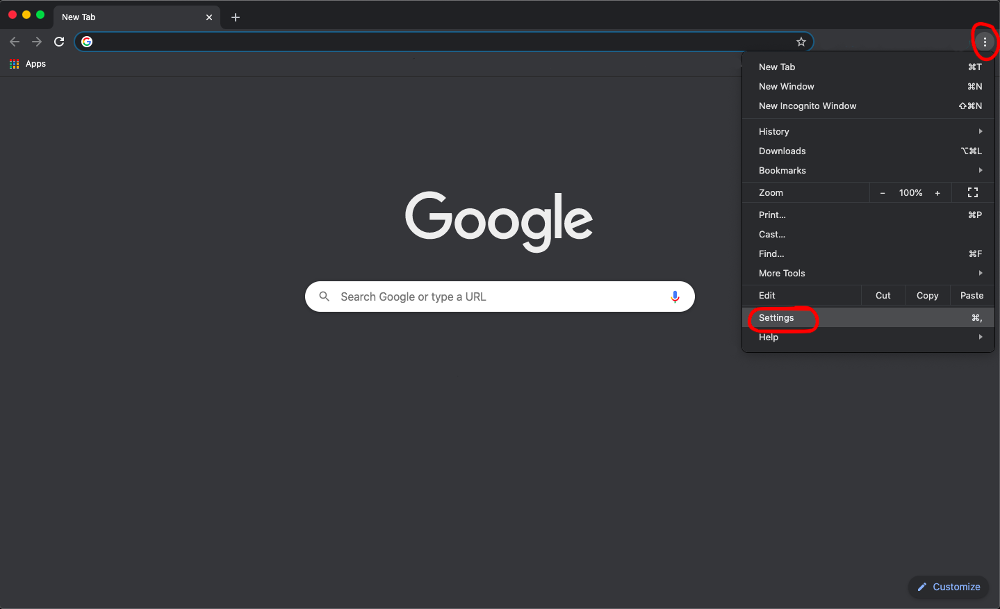
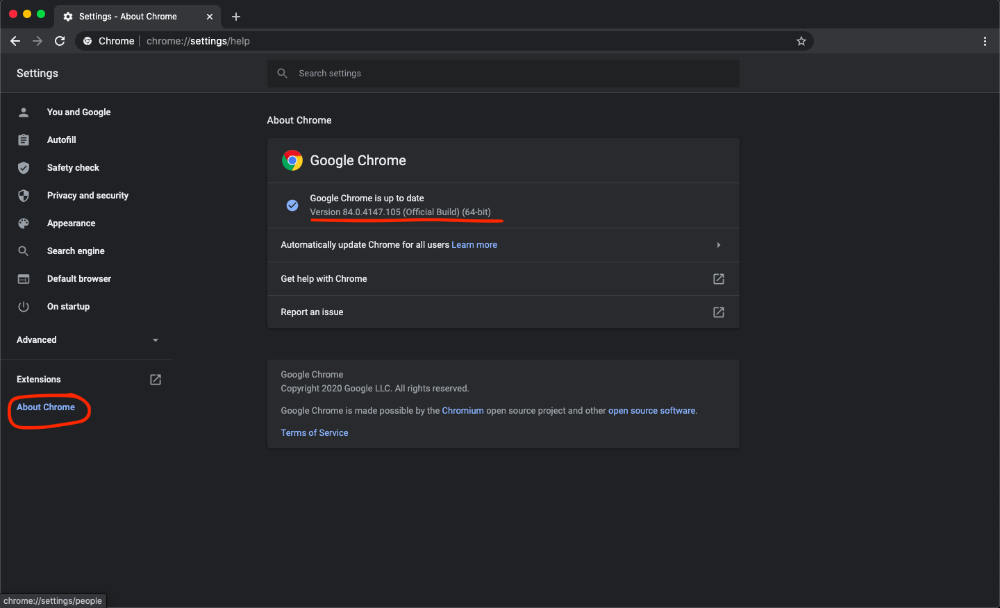
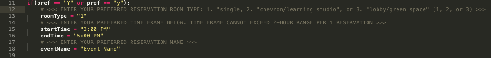
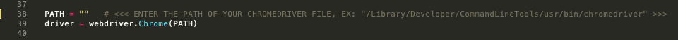
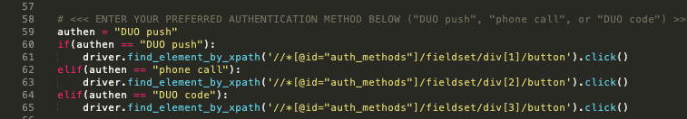

# **ZachryRoomReserver**
This is a project that allows TAMU - College Station engineers to semi-automate the room reservation process for the Zachry Engineering Education Complex.

## **Requirements**
You will need Google Chrome, Python, and Selenium in order to use this program. If you do not already have Python, you can head over to their website to download it (https://www.python.org/). After getting Python, you can install Selenium using pip.

```bash
pip install selenium
```
After installing all of the above requirements, you will also need to download ChromeDriver here: https://sites.google.com/a/chromium.org/chromedriver/downloads

Be sure to download the ChromeDriver that is tailored to your personal version of Google Chrome. You can figure this out by going into settings on your Chrome browser and pressing "About Chrome" on the bottom left-hand side of the page.



## **Usage**
You can create reservations using either your set preferences or not. If you choose not to use your set even preferences, you can still reserve a room through this program by answering the prompted questions. You can create your preferences by following the steps below.

### **Setting Your Preferences**
In the code, you will see a section where you can write out your preferences in the variables given:


Be sure to read the commments that correspond to each variable to ensure that the preferences are set correctly.

### **Other Variables Used**
The variable *PATH* is used to enter the directory path of your ChromeDriver file that you downloaded previously:  


The variables *usernameInput* and *passwordInput* are used for you to enter your NetID and password to automate the login process:  


The variable *authen* is used for you to enter your authentication method preference to automate the method selection:  


## **Demo**
